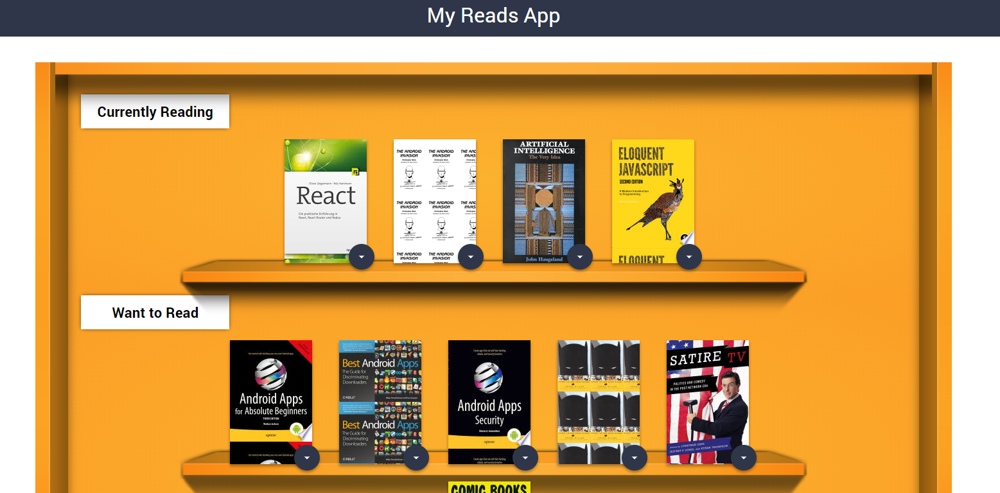

# MyReads

A bookshelf app that allows you to select and categorize books you have read, are currently reading, or want to read. The project was created for the React Nanodegree program
and emphasizes using React to build the application.  


### Getting Started

```
git clone https://github.com/Jansser/my-reads-app.git
```

```
cd myreads

npm install
```

```
npm start
```
You can find a live version at https://my-reads-app-jansser-robuqapicf.now.sh/



## Running the tests

```
npm test
```

## Deployment

```
npm build
```